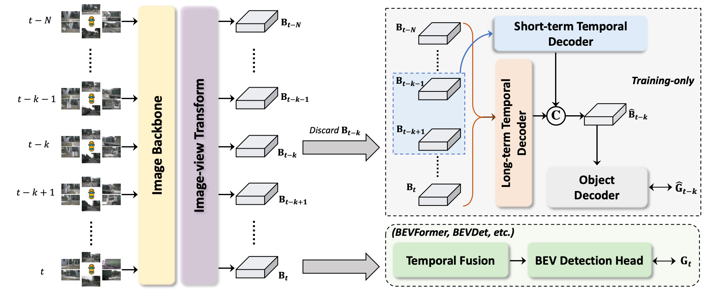

# Temporal Enhanced Training of Multi-view 3D Object Detector via Historical Object Prediction

[](https://paperswithcode.com/sota/3d-object-detection-on-nuscenes-camera-only?p=temporal-enhanced-training-of-multi-view-3d)

This repo is the official implementation of ["Temporal Enhanced Training of Multi-view 3D Object Detector via Historical Object Prediction"](https://arxiv.org/abs/2304.00967) by Zhuofan Zong, Dongzhi Jiang, Guanglu Song, Zeyue Xue, Jingyong Su, Hongsheng Li, and Yu Liu.


## News
* ***[07/25/2023]*** Code for HoP on BEVDet is released!
* ***[07/14/2023]*** HoP is accepted to ICCV 2023!
* ***[04/05/2023]*** HoP achieves new SOTA performance on [nuScenes 3D detection leaderboard](https://www.nuscenes.org/object-detection?externalData=all&mapData=all&modalities=Camera) with **68.5 NDS** and **62.4 mAP**.

## Model Zoo

### Result on BEVDet4D-Depth

|          model           | backbone |   pretrain   | img size | Epoch |  NDS   |  mAP   |                            config                            |                             ckpt                             |                             log                              |
| :----------------------: | :------: | :----------: | :------: | :---: | :----: | :----: | :----------------------------------------------------------: | :----------------------------------------------------------: | :----------------------------------------------------------: |
| BEVDet4D-Depth(Baseline) |  Res50   | [ImageNet]() | 256x704  |  24   | 0.4930 | 0.3848 | [cfg](https://github.com/Sense-X/HoP/blob/main/configs/hop_bevdet/bevdet4d-r50-depth.py) | [ckpt](https://github.com/Sense-X/HoP/releases/download/Release/BEVDet_ep24_ema.pth) | [log](https://github.com/Sense-X/HoP/releases/download/Release/BEVDet.log) |
|    HoP_BEVDet4D-Depth    |  Res50   | [ImageNet]() | 256x704  |  24   | 0.5099 | 0.3990 | [cfg](https://github.com/Sense-X/HoP/blob/main/configs/hop_bevdet/hop_bevdet4d-r50-depth.py) | [ckpt](https://github.com/Sense-X/HoP/releases/download/Release/HoP_BEVDet_ep24_ema.pth) | [log](https://github.com/Sense-X/HoP/releases/download/Release/HoP_BEVDet.log) |

## Get Started

### Install

We train our models under the following environment: 

```
python=3.6.9
pytorch=1.8.1
torchvision=0.9.1
cuda=11.2
```

Other versions may possibly be imcompatible.

We use [MMDetection3D V1.0.0rc4](https://github.com/open-mmlab/mmdetection3d/tree/v1.0.0rc4), [MMDetection V2.24.0](https://github.com/open-mmlab/mmdetection/releases/tag/v2.25.3) and [MMCV V1.5.0](https://github.com/open-mmlab/mmcv/releases/tag/v1.5.0). The source code of MMDetection3D has been included in this repo.

You can take the following steps to install packages above: 

1. Build MMCV following [official instructions](https://github.com/open-mmlab/mmcv/tree/v1.5.2#installation). 

2. Install MMDetection by 

   ```bash
   pip install mmdet==2.24.0
   ```

3. Copy HoP repo and install MMDetection3D.

   ```bash
   git clone git@github.com:Sense-X/HoP.git
   cd HoP
   pip install -e .
   ```

### Data Preparation

Follow the steps to prepare nuScenes Dataset introduced in [nuscenes_det.md](https://github.com/HuangJunJie2017/BEVDet/blob/dev2.1/docs/en/datasets/nuscenes_det.md) and create the pkl by running:

```bash
python tools/create_data_bevdet.py
```

### Train HoP

```bash
# single gpu
python tools/train.py configs/hop_bevdet/hop_bevdet4d-r50-depth.py
# multiple gpu
./tools/dist_train.sh configs/hop_bevdet/hop_bevdet4d-r50-depth.py $num_gpu
```

### Eval HoP

```bash
# single gpu
python tools/test.py configs/hop_bevdet/hop_bevdet4d-r50-depth.py $checkpoint --eval bbox
# multiple gpu
./tools/dist_test.sh configs/hop_bevdet/hop_bevdet4d-r50-depth.py $checkpoint $num_gpu --eval bbox
```

## Method



## TODO

- [ ] Release code for HoP on BEVFormer.


## Cite HoP

If you find this repository useful, please use the following BibTeX entry for citation.

```latex
@misc{hop2023,
      title={Temporal Enhanced Training of Multi-view 3D Object Detector via Historical Object Prediction},
      author={Zhuofan Zong and Dongzhi Jiang and Guanglu Song and Zeyue Xue and Jingyong Su and Hongsheng Li and Yu Liu},
      year={2023},
      eprint={2304.00967},
      archivePrefix={arXiv},
      primaryClass={cs.CV}
}
```

## License

This project is released under the MIT license. Please see the [LICENSE](LICENSE) file for more information.